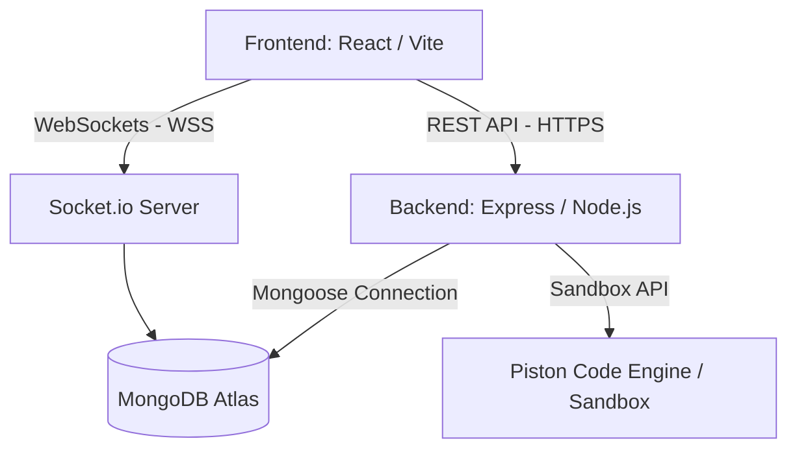

# ⚡ Clash of Codes ⚡

[](https://clash-of-codes-ten.vercel.app/)
[](https://vitejs.dev/)
[](https://reactjs.org/)
[](https://nodejs.org/)
[](https://www.mongodb.com/)

An arena for real-time competitive coding battles! Clash of Codes allows developers to host lobbies, select programming topics/difficulty, challenge peers, and write and run solutions against tests in a race against the clock.

🔗 **Play Now:** [https://clash-of-codes-ten.vercel.app/](https://clash-of-codes-ten.vercel.app/)

---

## ✨ Features

- **🎮 Real-Time Lobbies**: Join public rooms or create private arenas with a custom maximum player count.
- **⚡ Real-Time Player & Lobby Updates**: Built on persistent WebSockets to instantly sync topics, difficulties, user joins/leaves, and match starts.
- **🎨 Modern Glassmorphic Design**: An aurora-infused dark UI with smooth animations, custom confirmation modals, and responsive layout interfaces.
- **🔒 Active Session Recovery**: Automatic detection of active ongoing contests on login; if you refresh or switch browsers, you will be redirected straight back to your active duel.
- **⚙️ Dynamic Code Execution**: Runs user-submitted code against a suite of public and private test cases. Supports multiple sandbox backends (local execution or secure EMKC Piston proxies).
- **🔑 Secure Authentication**: Traditional email/password alongside one-click Google OAuth authentication.
- **👤 User Profiles & History**: Keep track of your past contest performances, lobby history, or manage your account settings (including secure account deletion).

---

## 🛠️ Tech Stack

- **Frontend**: React, React Router Dom, Socket.io-client, TailwindCSS / Custom Glassmorphism.
- **Backend**: Node.js, Express, Socket.io, JWT Authentication, CORS.
- **Database**: MongoDB (via Mongoose).
- **Execution Sandbox**: Piston Execution Proxy / Custom Node VM runner.

---

## 📐 Architecture Overview



---

## 🚀 Local Development Setup

To run this project locally, clone the repository and configure your backend and frontend.

### 1. Prerequisites
- Node.js (v18+)
- MongoDB (Local or Atlas Uri)

### 2. Configure the Backend
1. Navigate to the `/backend` folder:
   ```bash
   cd backend
   ```
2. Install dependencies:
   ```bash
   npm install
   ```
3. Create a `.env` file in `/backend` with the following variables:
   ```env
   PORT=5000
   MONGO_URI=your_mongodb_connection_string
   JWT_SECRET=your_super_secret_jwt_key
   EXECUTION_MODE=local   # options: local, piston-proxy
   FRONTEND_URL=http://localhost:5173
   ```
4. Start the backend:
   ```bash
   npm run dev
   ```

### 3. Configure the Frontend
1. Navigate to the `/frontend` folder:
   ```bash
   cd ../frontend
   ```
2. Install dependencies:
   ```bash
   npm install
   ```
3. Start the Vite dev server:
   ```bash
   npm run dev
   ```
4. Open [http://localhost:5173](http://localhost:5173) in your browser.

---

## 📦 Deployment Configuration

When deploying the application to production, make sure the environment variables are correctly mapped:

### Frontend Environment Variables (e.g. Vercel)
- `VITE_API_URL`: Point this to your backend service (e.g. `https://clashcodes.onrender.com`).

### Backend Environment Variables (e.g. Render / Railway)
- `FRONTEND_URL`: Point this to your frontend Vercel URL (e.g. `https://clash-of-codes-ten.vercel.app`).
- `EXECUTION_MODE`: Set to `piston-proxy` to sandbox execution.

---

## 🛡️ License

This project is licensed under the MIT License.
